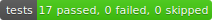

# LightningSharing

Lightning Components  Apex to implement adhoc sharing in Lightning Experience

For more information, please see the <a href="https://salesforce.quip.com/AJeQA2j2bMw5">documentation</a>

## Contributing or using from Source
Apologies, but this thing has the ltngsharing__ namespace used throughout.  You'll need to get rid of that, and remove it from the testdata and project.json file if you want to work on the source, deploy to a scratch org, or use the unpackaged version in production.

I need to make some tooling for doing a build with/without namespace, but haven't yet.

## Test results

| Branch   | Status                               | Test Coverage                      | SonarQube |
| -------- | ------------------------------------ | ---------------------------------- | ---- |
| Summer20 |  |  | ---- |
| Winter 21 |  |  |  |
